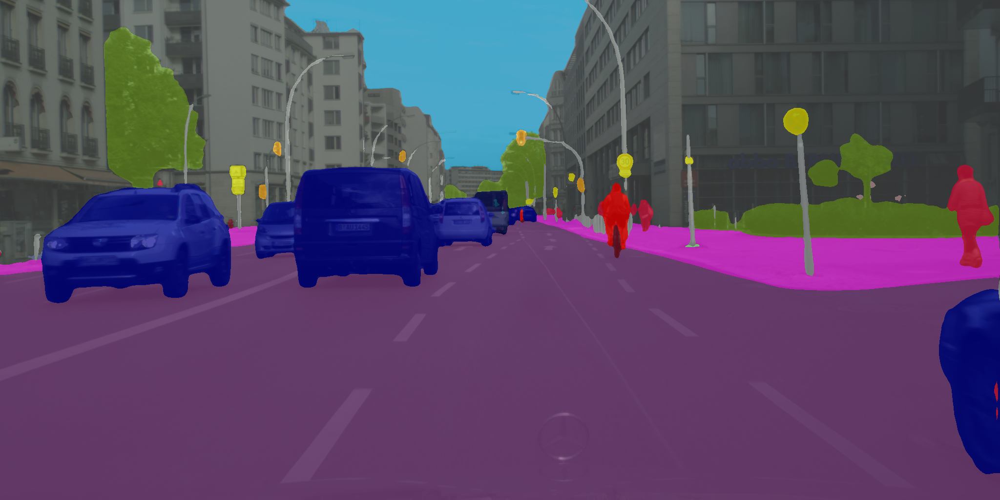

# MXNetSeg

This project provides modular implementation for state-of-the-art semantic segmentation models based on the [MXNet](https://github.com/apache/incubator-mxnet) framework and [GluonCV](https://github.com/dmlc/gluon-cv) toolkit. See [MindSeg](https://github.com/BebDong/MindSeg) for a mirror implemented by the [HUAWEI MindSpore](https://www.mindspore.cn/en).



## Bright Spots

- Ease of use and extension pipeline for the semantic segmentation task, including data pre-processing, model definition, network training and evaluation.

- Parallel training on GPUs.

- Multiple supported models.

  - Fully Convolutional Networks for Semantic Segmentation [FCN, CVPR2015, [paper](https://www.cv-foundation.org/openaccess/content_cvpr_2015/papers/Long_Fully_Convolutional_Networks_2015_CVPR_paper.pdf)]
  - Attention to Scale: Scale-Aware Semantic Image Segmentation [Att2Scale, CVPR2016, [paper](http://openaccess.thecvf.com/content_cvpr_2016/papers/Chen_Attention_to_Scale_CVPR_2016_paper.pdf)]
  - Rethinking Atrous Convolution for Semantic Image Segmentation [DeepLabv3, arXiv2017, [paper](https://arxiv.org/pdf/1706.05587.pdf)]
  - Ladder-Style DenseNets for Semantic Segmentation of Large Natural Images [LadderDensenet, ICCVW2017, [paper](http://openaccess.thecvf.com/content_ICCV_2017_workshops/papers/w3/Kreso_Ladder-Style_DenseNets_for_ICCV_2017_paper.pdf)]
  - Pyramid Scene Parsing Network [PSPNet, CVPR2017, [paper](http://openaccess.thecvf.com/content_cvpr_2017/papers/Zhao_Pyramid_Scene_Parsing_CVPR_2017_paper.pdf)]
  - BiSeNet: Bilateral segmentation network for real-time semantic segmentation [BiSeNet, ECCV2018, [paper](http://openaccess.thecvf.com/content_ECCV_2018/papers/Changqian_Yu_BiSeNet_Bilateral_Segmentation_ECCV_2018_paper.pdf)]
  - Encoder-decoder with atrous separable convolution for semantic image segmentation [DeepLabv3+, ECCV2018, [paper](http://openaccess.thecvf.com/content_ECCV_2018/papers/Liang-Chieh_Chen_Encoder-Decoder_with_Atrous_ECCV_2018_paper.pdf)]
  - DenseASPP for Semantic Segmentation in Street Scenes [DenseASPP, CVPR2018, [paper](http://openaccess.thecvf.com/content_cvpr_2018/papers/Yang_DenseASPP_for_Semantic_CVPR_2018_paper.pdf)]
  - Towards Bridging Semantic Gap to Improve Semantic Segmentation [SeENet, ICCV2019, [paper](http://openaccess.thecvf.com/content_ICCV_2019/papers/Pang_Towards_Bridging_Semantic_Gap_to_Improve_Semantic_Segmentation_ICCV_2019_paper.pdf)]
  - ACFNet: Attentional Class Feature Network for Semantic Segmentation [ACFNet, ICCV2019, [paper](https://openaccess.thecvf.com/content_ICCV_2019/papers/Zhang_ACFNet_Attentional_Class_Feature_Network_for_Semantic_Segmentation_ICCV_2019_paper.pdf)]
  - Dual Attention Network for Scene Segmentation [DANet, CVPR2019, [paper](https://openaccess.thecvf.com/content_CVPR_2019/papers/Fu_Dual_Attention_Network_for_Scene_Segmentation_CVPR_2019_paper.pdf)]
  - In Defense of Pre-trained ImageNet Architectures for Real-time Semantic Segmentation of Road-driving Images [SwiftNet, CVPR2019, [paper](http://openaccess.thecvf.com/content_CVPR_2019/papers/Orsic_In_Defense_of_Pre-Trained_ImageNet_Architectures_for_Real-Time_Semantic_Segmentation_CVPR_2019_paper.pdf)]
  - Panoptic Feature Pyramid Networks [SemanticFPN, CVPR2019, [paper](https://openaccess.thecvf.com/content_CVPR_2019/papers/Kirillov_Panoptic_Feature_Pyramid_Networks_CVPR_2019_paper.pdf)]
  - Attention-guided Chained Context Aggregation for Semantic Segmentation [CANet, arXiv2020, [paper](https://arxiv.org/abs/2002.12041)]
  - EPRNet: Efficient Pyramid Representation Network for Real-Time Street Scene Segmentation [EPRNet, TITS2021, [paper](https://ieeexplore.ieee.org/stamp/stamp.jsp?tp=&arnumber=9384352)]
  - AttaNet: Attention-Augmented Network for Fast and Accurate Scene Parsing [AttaNet, AAAI2021, [paper](https://www.aaai.org/AAAI21Papers/AAAI-103.SongQ.pdf)]
  - An Image is Worth 16x16 Words: Transformers for Image Recognition at Scale [ViT, ICLR2021, [paper](https://arxiv.org/pdf/2010.11929.pdf)]
  - Rethinking Semantic Segmentation from a Sequence-to-Sequence Perspective with Transformers [SETR, CVPR2021, [paper](https://openaccess.thecvf.com/content/CVPR2021/papers/Zheng_Rethinking_Semantic_Segmentation_From_a_Sequence-to-Sequence_Perspective_With_Transformers_CVPR_2021_paper.pdf)]
  - FaPN: Feature-aligned Pyramid Network for Dense Image Prediction [FaPN, ICCV2021, [paper](http://www.shihuahuang.cn/fapn/)]
  - AlignSeg: Feature-Aligned Segmentation Networks [AlignSeg, TPAMI2021, [paper](https://ieeexplore.ieee.org/document/9366388)]

## Benchmarks

We note that:

- OS is output stride of the backbone network.
- \* denotes multi-scale and flipping testing, otherwise single-scale inputs.
- No whistles and bells are adopted, e.g. OHEM or multi-grid.

### Cityscapes

| Model     | Backbone  |  OS  | #Params |    TrainSet     | EvalSet | mIoU | \*mIoU |
| :-------- | :-------: | :--: | :-----: | :-------------: | :-----: | :--: | :----: |
| BiSeNet   | ResNet18  |  32  |  13.2M  |  *train_fine*   |  *val*  | 71.6 |  74.7  |
| BiSeNet   | ResNet18  |  32  |  13.2M  | *trainval_fine* | *test*  |  -   |  74.8  |
| FCN       | ResNet18  |  32  |  12.4M  |  *train_fine*   |  *val*  | 64.9 |  68.1  |
| FCN       | ResNet18  |  8   |  12.4M  |  *train_fine*   |  *val*  | 68.3 |  69.9  |
| FCN       | ResNet50  |  8   |  28.4M  |  *train_fine*   |  *val*  | 71.7 |   -    |
| FCN       | ResNet101 |  8   |  47.5M  |  *train_fine*   |  *val*  | 74.5 |   -    |
| PSPNet    | ResNet101 |  8   |  56.4M  |  *train_fine*   |  *val*  | 78.2 |  79.5  |
| DeepLabv3 | ResNet101 |  8   |  58.9M  |  *train_fine*   |  *val*  | 79.3 |  80.0  |
| DenseASPP | ResNet101 |  8   |  69.4M  |  *train_fine*   |  *val*  | 78.7 |  79.8  |
| DANet     | ResNet101 |  8   |  66.7M  |  *train_fine*   |  *val*  | 79.7 |  80.9  |

### ADE20K

| Model  | Backbone  |  OS  | TrainSet | EvalSet |  PA  | mIoU | \*PA | \*mIoU |
| :----: | :-------: | :--: | :------: | :-----: | :--: | :--: | :--: | :----: |
| PSPNet | ResNet101 |  8   | *train*  |  *val*  | 80.1 | 42.9 | 80.9 |  43.7  |

### Pascal VOC 2012

| Model            | Backbone  |  OS  |  TrainSet   | EvalSet |  PA  | mIoU | \*PA | \*mIoU |
| :--------------- | :-------: | :--: | :---------: | :-----: | :--: | :--: | :--: | :----: |
| FCN              | ResNet101 |  8   | *train_aug* |  *val*  | 94.4 | 74.6 | 94.5 |  75.0  |
| AttentionToScale | ResNet101 |  8   | *train_aug* |  *val*  | 94.8 | 77.1 |  -   |   -    |
| PSPNet           | ResNet101 |  8   | *train_aug* |  *val*  | 95.1 | 78.1 | 95.3 |  78.5  |
| DeepLabv3        | ResNet101 |  8   | *train_aug* |  *val*  | 95.5 | 80.1 | 95.6 |  80.4  |
| DeepLabv3+       | ResNet101 |  8   | *train_aug* |  *val*  | 95.5 | 79.9 | 95.6 |  80.1  |

### NYUv2

| Model      | Backbone  |  OS  | TrainSet | EvalSet |  PA  | mIoU | *PA  | *mIoU |
| :--------- | :-------: | :--: | :------: | :-----: | :--: | :--: | :--: | :---: |
| FCN        | ResNet101 |  8   | *train*  |  *val*  | 69.2 | 39.7 | 70.2 | 41.0  |
| PSPNet     | ResNet101 |  8   | *train*  |  *val*  | 71.3 | 43.0 | 71.9 | 43.6  |
| DeepLabv3+ | ResNet101 |  8   | *train*  |  *val*  | 73.5 | 46.0 | 74.3 | 47.2  |

## Environment

We adopt python 3.6.2 and CUDA 10.1 in this project.

1. Prerequisites

   ```shell
   pip install -r requirements.txt
   ```

   Note that we employ [wandb](https://github.com/wandb/client) for log and visualization. Refer to [here](https://docs.wandb.ai/quickstart) for a QuickStart.

2. [Detail API](https://github.com/zhanghang1989/detail-api) for Pascal Context dataset

## Usage

### Training

1. Configure hyper-parameters in `./mxnetseg/config.yml`

2. Run the `./mxnetseg/train.py` script

   ```shell
   python train.py --ctx 0 1 2 3 --wandb wandb-demo
   ```

3. During training, the program will automatically create a sub-folder `./weights/{model_name}`  to save model checkpoints/parameters.

### Inference

Simply run the `./mxnetseg/eval.py` with arguments need to be specified

```shell
python eval.py --model FCNResNet --backbone resnet18 --checkpoint fcn_resnet18_Cityscapes_20191900_310600_best.params --ctx 0 --data Cityscapes --crop 768 --base 2048 --mode val --ms
```

About the `mode`:

- `val`: to get mIoU and PA metrics on the validation set.
- `test`: to get colored predictions on the test set.
- `testval`: to get colored predictions on the validation set.

## Citations

Please kindly cite our paper if you feel our codes help in your research.

```BibTex
@article{tang2021attention,
  title={Attention-guided chained context aggregation for semantic segmentation},
  author={Tang, Quan and Liu, Fagui and Zhang, Tong and Jiang, Jun and Zhang, Yu},
  journal={Image and Vision Computing},
  pages={104309},
  year={2021},
  publisher={Elsevier}
}

@article{tang2021eprnet,
  title={EPRNet: Efficient Pyramid Representation Network for Real-Time Street Scene Segmentation},
  author={Tang, Quan and Liu, Fagui and Jiang, Jun and Zhang, Yu},
  journal={IEEE Transactions on Intelligent Transportation Systems},
  year={2021},
  publisher={IEEE}
}
```

