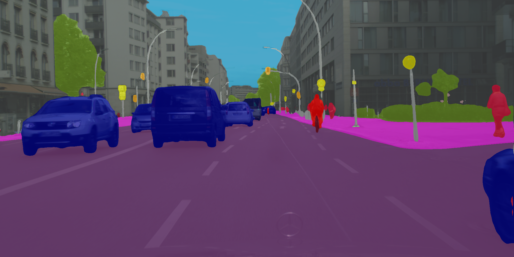

# MXNetSeg

This project provides modular implementation for state-of-the-art semantic segmentation models based on the [MXNet/Gluon](https://github.com/apache/incubator-mxnet) framework and [GluonCV](https://github.com/dmlc/gluon-cv) toolkit.



## Supported Models

| Method                                                       | Reference  |
| ------------------------------------------------------------ | ---------- |
| [Attention to scale](http://openaccess.thecvf.com/content_cvpr_2016/papers/Chen_Attention_to_Scale_CVPR_2016_paper.pdf) | CVPR 2016  |
| [BiSeNet](http://openaccess.thecvf.com/content_ECCV_2018/papers/Changqian_Yu_BiSeNet_Bilateral_Segmentation_ECCV_2018_paper.pdf) | ECCV 2018  |
| [CANet](https://arxiv.org/pdf/2002.12041)                    | ArXiv 2020 |
| [DeepLabv3](https://arxiv.org/pdf/1706.05587)                | ArXiv 2017 |
| [DeepLabv3+](http://openaccess.thecvf.com/content_ECCV_2018/papers/Liang-Chieh_Chen_Encoder-Decoder_with_Atrous_ECCV_2018_paper.pdf) | ECCV 2018  |
| [DenseASPP](http://openaccess.thecvf.com/content_cvpr_2018/papers/Yang_DenseASPP_for_Semantic_CVPR_2018_paper.pdf) | CVPR 2018  |
| [FCN](https://www.cv-foundation.org/openaccess/content_cvpr_2015/papers/Long_Fully_Convolutional_Networks_2015_CVPR_paper.pdf) | CVPR 2015  |
| [LadderDenseNet](http://openaccess.thecvf.com/content_ICCV_2017_workshops/papers/w3/Kreso_Ladder-Style_DenseNets_for_ICCV_2017_paper.pdf) | ICCVW 2017 |
| [PSPNet](http://openaccess.thecvf.com/content_cvpr_2017/papers/Zhao_Pyramid_Scene_Parsing_CVPR_2017_paper.pdf) | CVPR 2017  |
| [SeENet](http://openaccess.thecvf.com/content_ICCV_2019/papers/Pang_Towards_Bridging_Semantic_Gap_to_Improve_Semantic_Segmentation_ICCV_2019_paper.pdf) | ICCV 2019  |
| [SwiftNet/SwiftNetPR](http://openaccess.thecvf.com/content_CVPR_2019/papers/Orsic_In_Defense_of_Pre-Trained_ImageNet_Architectures_for_Real-Time_Semantic_Segmentation_CVPR_2019_paper.pdf) | CVPR 2019  |
| [SemanticFPN](https://openaccess.thecvf.com/content_CVPR_2019/papers/Kirillov_Panoptic_Feature_Pyramid_Networks_CVPR_2019_paper.pdf) | CVPR 2019  |

## Benchmarks

We note that 'ss' denotes single scale testing and 'ms' multi-scale and flipping testing.

### Cityscapes

| Model     | Backbone  |  Dilate  |   TrainSet   | EvalSet | mIoU (ss) | mIoU (ms) |   OHEM   |
| :-------- | :-------: | :------: | :----------: | :-----: | :-------: | :-------: | :------: |
| FCN-32s   | ResNet18  | &#x2717; | *train_fine* |  *val*  |   64.94   |   68.08   | &#x2717; |
| FCN-32s   | ResNet18  | &#x2713; | *train_fine* |  *val*  |   68.28   |   69.86   | &#x2717; |
| FCN-32s   | ResNet101 | &#x2713; | *train_fine* |  *val*  |   74.54   |     -     | &#x2717; |
| PSPNet    | ResNet101 | &#x2713; | *train_fine* |  *val*  |   78.19   |   79.49   | &#x2717; |
| DeepLabv3 | ResNet101 | &#x2713; | *train_fine* |  *val*  |   78.72   |     -     | &#x2717; |
| DANet     | ResNet101 | &#x2713; | *train_fine* |  *val*  |   79.73   |   80.87   | &#x2717; |

### ADE20K

| Model  | Backbone  |  Dilate  | TrainSet | EvalSet | PA (SS) | mIoU (ss) | PA (ms) | mIoU (ms) |
| :----: | :-------: | :------: | :------: | :-----: | :-----: | :-------: | :-----: | :-------: |
| PSPNet | ResNet101 | &#x2713; | *train*  |  *val*  |  80.14  |   42.87   |  80.86  |   43.67   |

## Environment

We adopt python 3.7.9 and CUDA 10.1 in this project.

1. Prerequisites

   ```shell
   pip install -r requirements.txt
   ```

   Note that we employ [wandb](https://github.com/wandb/client) for log and visualization. Refer to [here](https://docs.wandb.ai/quickstart) for a QuickStart.

2. [Detail API](https://github.com/zhanghang1989/detail-api) for Pascal Context dataset

## Usage

### Training

1. Configure hyper-parameters in `./mxnetseg/config.yml`

2. Run the `./mxnetseg/train.py` script

   ```shell
   python train.py --model fcn --ctx 0 1 2 3 --wandb wandb-demo
   ```

### Inference

Simply run the `./mxnetseg/eval.py` with arguments need to be specified

```shell
python eval.py --model fcn --backbone resnet18 --checkpoint fcn_resnet18_Cityscapes_20191900_310600_best.params --ctx 0 --data cityscapes --crop 768 --base 2048 --mode val --ms
```

About the `mode`:

- `val`: to get mIoU and PA metrics on the validation set.
- `test`: to get colored predictions on the test set.
- `testval`: to get colored predictions on the validation set.

## Citations

Please kindly cite our paper if you feel our codes help in your research.

```BibTex
@article{tang2020attention,
  title={Attention-guided Chained Context Aggregation for Semantic Segmentation},
  author={Tang, Quan and Liu, Fagui and Jiang, Jun and Zhang, Yu},
  journal={arXiv preprint arXiv:2002.12041},
  year={2020}
}
```

